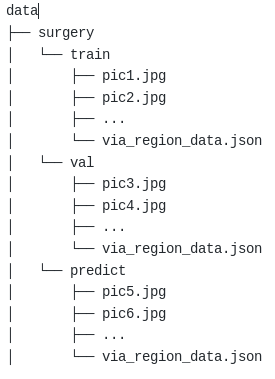
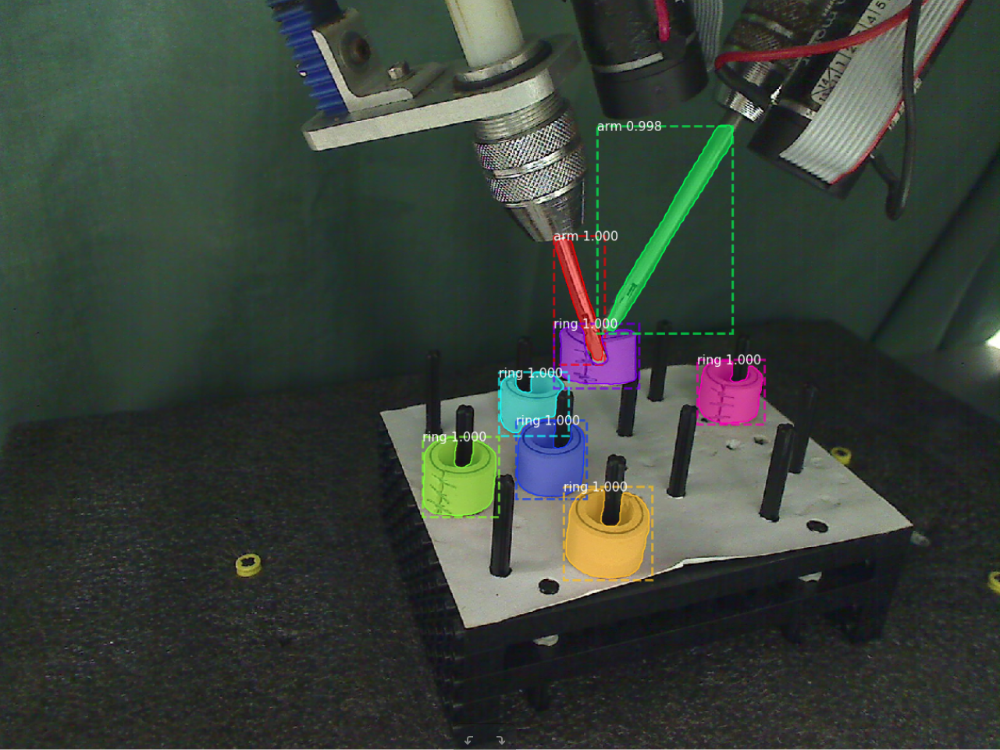
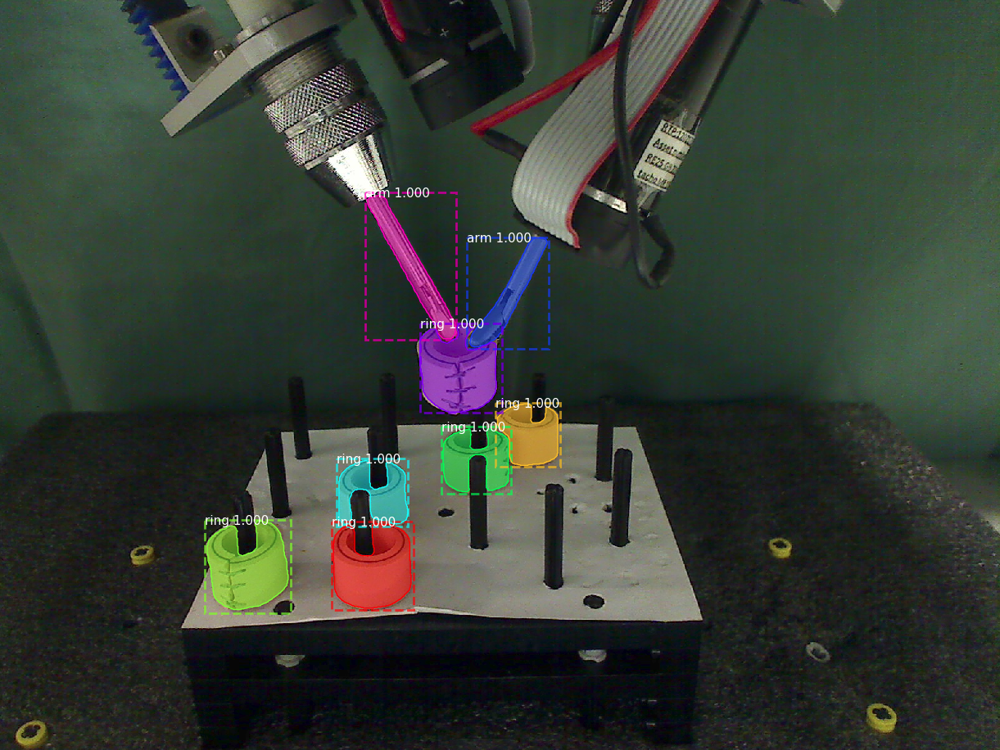

# Mask R-CNN for Object Detection and Segmentation

This is a project for surgery robot target detection and segmentation based on implementation of [Mask R-CNN](https://arxiv.org/abs/1703.06870) by (https://github.com/matterport/Mask_RCNN) on Python 3, Keras, and TensorFlow. The model generates bounding boxes and segmentation masks for each instance of an object in the image. It's based on Feature Pyramid Network (FPN) and a ResNet101 backbone. 

The repository includes:
* Source code of Mask R-CNN built on FPN and ResNet101.
* Instruction and training code for the surgery robot dataset
* Pre-trained weights on MS COCO and ImageNet
* Jupyter notebooks to visualize the detection result
* Example of training on your own dataset, with emphasize on how to build and adapt codes to dataset with multiple classes.

# Video Demo
### [4K Video Demo](https://www.youtube.com/watch?v=OOT3UIXZztE) by Karol Majek.
[](https://www.youtube.com/watch?v=OOT3UIXZztE)

# Training on Your own Dataset
Pre-trained weights from MS COCO and ImageNet are provided for you to fine-tune over new dataset. Start by reading this [blog post about the balloon color splash sample](https://engineering.matterport.com/splash-of-color-instance-segmentation-with-mask-r-cnn-and-tensorflow-7c761e238b46). It covers the process starting from annotating images to training to using the results in a sample application.

In summary, to train the model you need to modify two classes in ```surgery.py```:
1. ```SurgeryConfig``` This class contains the default configurations. Modify the attributes for your training, most importantly the ```NUM_CLASSES```.
2. ```SurgeryDataset``` This class inherits from ```utils.Dataset``` which provides capability to train on new dataset without modifying the model. In this project I will demonstrate with a dataset labeled by VGG Image Annotation(VIA). If you are also trying to label a dataset for your own images, start by reading this [blog post about the balloon color splash sample](https://engineering.matterport.com/splash-of-color-instance-segmentation-with-mask-r-cnn-and-tensorflow-7c761e238b46). 
First of all, for training you need to add class in function ```load_VIA```
```
self.add_class("SourceName", ClassID, "ClassName")
#For example:
self.add_class("surgery", 1, "arm")  #means add a class named "arm" with class_id "1" from source "surgery"
......
```
Then extend function ```load_mask``` for reading different class names from annotations
For example, if you assign name "a" to class "arm" when you are labelling, according to its class_id defined in ```load_VIA```
```
class_ids = np.zeros([len(info["polygons"])])
for i, p in enumerate(class_names):
   if p['name'] == 'a':
      class_ids[i] = 1
      ......
```
3. The data directories for this project are as following. Make sure you include corresponding annotations(.json) in correct directory.



Now you should be able to start training on your own dataset! Training parapeters are mainly included in function ```train``` in ```surgery.py```.
```
#Train a new model starting from pre-trained COCO weights
python surgery.py train --dataset=/home/.../mask_rcnn/data/surgery/ --weights=coco  

#Train a new model starting from pre-trained ImageNet weights
python surgery.py train --dataset=/home/.../mask_rcnn/data/surgery/ --weights=imagenet

# Continue training the last model you trained. This will find
# the last trained weights in the model directory.
python surgery.py train --dataset=/home/.../mask_rcnn/data/surgery/ --weights=last
```

# Prediction, Visualization, Evaluation
Two functions ```detect``` and ```detect_and_color_splash``` in ```surgery.py``` for detection are provides in this project.
To use ```detect_and_color_splash```, you need to add class_names according to your dataset
```
class_names = ['BG', 'arm', 'ring']
```
You can make prediction on a specific image, images in a specific directory or even a video, by
```
#Detect and color splash on a single image with the last model you trained.
#This will find the last trained weights in the model directory.
python surgery.py splash --weights=last --image=/home/...../*.jpg

#Detect and color splash on images in a directory
python surgery.py detect --weights=last --dataset=/home/.../mask_rcnn/data/surgery/ --subset=predict

#Detect and color splash on a video with a specific pre-trained weights of yours.
python sugery.py splash --weights=/home/.../logs/mask_rcnn_surgery_0030.h5  --video=/home/simon/Videos/Center.wmv
```
* [prediction.ipynb](prediction.ipynb) provides step-by-step prediction and visualization on your own dataset. You can also roughly evaluate the model with metrics of overall accuracy and precision.

# Instance Segmentation Samples on Robot Dataset
The model is trained based on pre-trained weights for MS COCO. 




# Configurations
Python 3.6.4, TensorFlow 1.7.0, Keras 2.1.5, CUDA 9.0, cudnn 7 and other common packages listed in `requirements.txt`.

# Installation
1. Install dependencies
   ```bash
   pip3 install -r requirements.txt
   ```
2. Clone this repository
3. Run setup from the repository root directory
    ```bash
    python3 setup.py install
    ``` 
3. The code will automatically download pretrained COCO weights when you select training with COCO weights. But in case it somehow doesn't work, download pre-trained COCO weights (mask_rcnn_coco.h5) from the [releases page](https://github.com/matterport/Mask_RCNN/releases).

